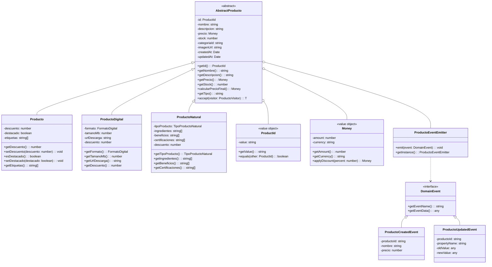

```mermaid
classDiagram

    %% Abstract Classes
    class AbstractProducto {
        <<abstract>>
        -id: ProductId
        -nombre: string
        -descripcion: string
        -precio: Money
        -stock: number
        -categoriaId: string
        -imagenUrl: string
        -createdAt: Date
        -updatedAt: Date
        +getId(): ProductId
        +getNombre(): string
        +getDescripcion(): string
        +getPrecio(): Money
        +getStock(): number
        +calcularPrecioFinal(): Money
        +getTipo(): string
        +accept(visitor: ProductoVisitor): T
    }

    %% Concrete Products
    class Producto {
        -descuento: number
        -destacado: boolean
        -etiquetas: string[]
        +getDescuento(): number
        +setDescuento(descuento: number): void
        +esDestacado(): boolean
        +setDestacado(destacado: boolean): void
        +getEtiquetas(): string[]
    }

    class ProductoDigital {
        -formato: FormatoDigital
        -tamanoMb: number
        -urlDescarga: string
        -descuento: number
        +getFormato(): FormatoDigital
        +getTamanoMb(): number
        +getUrlDescarga(): string
        +getDescuento(): number
    }

    class ProductoNatural {
        -tipoProducto: TipoProductoNatural
        -ingredientes: string[]
        -beneficios: string[]
        -certificaciones: string[]
        -descuento: number
        +getTipoProducto(): TipoProductoNatural
        +getIngredientes(): string[]
        +getBeneficios(): string[]
        +getCertificaciones(): string[]
    }

    %% Value Objects
    class ProductId {
        <<value object>>
        -value: string
        +getValue(): string
        +equals(other: ProductId): boolean
    }

    class Money {
        <<value object>>
        -amount: number
        -currency: string
        +getAmount(): number
        +getCurrency(): string
        +applyDiscount(percent: number): Money
    }

    %% Events
    class ProductoEventEmitter {
        +emit(event: DomainEvent): void
        +getInstance(): ProductoEventEmitter
    }

    class DomainEvent {
        <<interface>>
        +getEventName(): string
        +getEventData(): any
    }

    class ProductoCreatedEvent {
        -productoId: string
        -nombre: string
        -precio: number
    }

    class ProductoUpdatedEvent {
        -productoId: string
        -propertyName: string
        -oldValue: any
        -newValue: any
    }

    %% Relationships
    AbstractProducto <|-- Producto
    AbstractProducto <|-- ProductoDigital
    AbstractProducto <|-- ProductoNatural
    AbstractProducto o-- ProductId
    AbstractProducto o-- Money
    AbstractProducto o-- ProductoEventEmitter
    DomainEvent <|-- ProductoCreatedEvent
    DomainEvent <|-- ProductoUpdatedEvent
    ProductoEventEmitter ..> DomainEvent
```